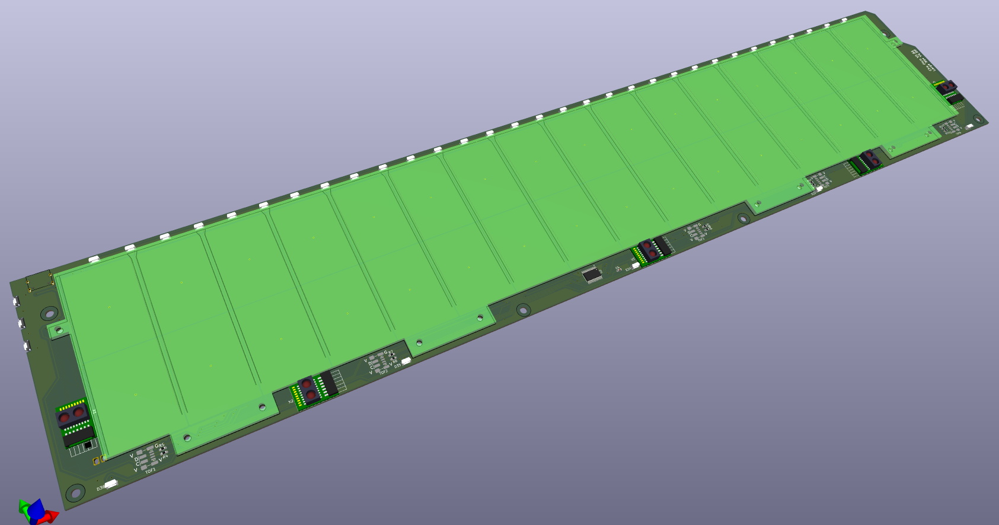

# Chu Pico Large - Chunithm Style Controller

This is a fork of whowechina's [Chu Pico](https://github.com/whowechina/chu_pico) project, which is a half-sized DIY controller for chunithm-style games.

**CURRENTLY IN DEVELOPMENT, BOARD HARDWARE NOT YET TESTED!**

Differences from upstream:

* 500x100 mm board with 460x82 touch (key) area instead of 233x52 touch area
* replaced capacitive touch sensors with SMD variants, put them all on back panel
* added a 4th capacitive touch sensor (4 keys = 8 regions each)
* added connections for IR towers on left and right side (simple soldering pads)

For more information, see https://github.com/whowechina/chu_pico

## Part List

* Go JLCPCB and make order with the gerber zip files, regular FR-4 board, thickness is **1.6mm**
  * latest `Production\PCB\chu_main_xxx_large_yyy.zip`
  * latest `Production\PCB\chu_air_xxx.zip`

### Main

* 1x Rasberry Pico Pi Pico or Pico W.  
  https://www.raspberrypi.com/products/raspberry-pi-pico
  Becareful of 3 pins that are at the other side, they're difficult to solder and may leave air bubbles.  
  

* 1x USB Type-C socket (918-418K2023S40001 or KH-TYPE-C-16P)
* 36x WS2812B-4020 side-facing RGB LEDs.  
  https://www.lcsc.com/product-detail/Light-Emitting-Diodes-LED_Worldsemi-WS2812B-4020_C965557.html
* 1x TCA9548APWR (TSSOP-24) I2C multiplexer.  
  https://www.lcsc.com/product-detail/Signal-Switches-Encoders-Decoders-Multiplexers_Texas-Instruments-TCA9548APWR_C130026.html
* 4x MPR121 capacitive touch modules
* 5x Sharp GP2Y0E03 or ST VL53L0X ToF sensor modules, you need cables as well. Please note that the pictures are taken from upstream and depict the small controller.  
  https://www.lcsc.com/product-detail/Angle-Linear-Position-Sensors_Sharp-Microelectronics-GP2Y0E03_C920270.html  
    
    
   You can use both of them in a same PCB, the firmware will identify each of them automatically.  
  
* 4x 0603 75kohm resistors (R14, R15, R16, R17; one next to each MPR121 module on backside)
* 2x 0603 5.1kohm resistors (R1, R2; next to USB port).
* 10x 0603 4.7kohm resistors (all the remaining resistors - value from schematic, upstream project calls for 5.1kohm in their README, so perhaps try these instead).
* 12x 0603 1uF (0.1~1uF all fine) capacitors (C1 to C12)
* 3x Panasonic EVQP46B3M tiny tactile switches.  
  https://industry.panasonic.com/global/en/products/control/switch/light-touch/number/evqp46b3m

### Air Tower

* 3x PT333-3B photo transistor (Q2, Q4, Q6)
* 3x IR333C-A infrared LED emitters (D1, D2, D3)
* 3x 2N7002 MOSFETs (60V 115mA 1.7Ω@5V,50mA 200mW 2.5V 1 N-channel SOT-23) OR AO3400A (unclear from schematic) (Q1, Q3, Q5)
* 2x 47uF D5xL5.4mm polarized capacitors (I picked RVT1A470M0505 47UF 10V, but don't know if this was right yet) (C1, C2)
* 3x 0603 1ohm resistors (R2, R4, R6)
* 3x 0603 10ohm resistors (R1, R3, R5)
* 3x 0603 2kohm resistors (R7, R8, R9)
* 1x 0603 10kohm resistors (R10)

### Light Guide Panel

I have not yet cut any light panel, but the raw cut plan for it is inside [`PCB/main/3dmodels/keypad_kicad.svg`](PCB/main/3dmodels/keypad_kicad.svg) (dimensions: 481x93 mm)

### Case

No case available yet, see PCB file for exact mounting hole positions

WIP case blender file in [Production/CAD/case_large.blend](Production/CAD/case_large.blend)

## Firmware

The firmware is not yet adjusted to the large version, but should work with the following changes:
- adjust key layout (MPR121 at address 0x5A has keys K1-K8, 0x5B has keys K9-K16, 0x5C has keys K17-K24, 0x5D has keys K25-K32)
- enable IR towers by default (optional)
